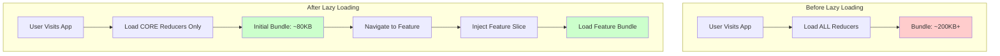

# Redux Toolkit Lazy Loading Implementation Plan

## Executive Summary

This document provides a comprehensive implementation plan for incorporating lazy loading with Redux Toolkit into the Markrin e-commerce project. Currently, the project uses React Context API for state management; this plan addresses setting up Redux from scratch with optimized lazy loading capabilities.

---

## Section 1: Current State Analysis

### 1.1 Existing State Management

| Context | Purpose | File Location |
|---------|---------|----------------|
| `AuthContext` | User authentication, session management | `frontend/markrin/src/context/AuthContext.jsx` |
| `CartContext` | Shopping cart operations | `frontend/markrin/src/context/CartContext.jsx` |
| `WishlistContext` | Wishlist management | `frontend/markrin/src/context/WishlistContext.jsx` |

### 1.2 Project Technology Stack

- **Build Tool**: Vite v7.3.1
- **React Version**: 19.2.0
- **Routing**: React Router DOM v7.12.0
- **State Management**: Context API (to be migrated to Redux)
- **Package Manager**: npm

### 1.3 Heavy Features Identified for Lazy Loading

Based on file size analysis and component complexity:

| Feature/Route | Estimated Size | Lazy Loading Priority |
|--------------|----------------|----------------------|
| Admin Panel (all routes) | ~100KB+ | **Critical** |
| Profile Page | ~47KB | High |
| ProductDetailsPage | ~41KB | High |
| Checkout Page | ~37KB | High |
| CartPage | ~37KB | High |
| CuratedStyleShopTheLook | ~42KB | Medium |
| ShoppableVideoCarousel | ~23KB | Medium |
| Shop Page | ~30KB | Medium |
| Contact Page | ~25KB | Medium |

### 1.4 Recommended Redux Toolkit Version

**Recommended Version**: `@reduxjs/toolkit@^2.5.0` and `react-redux@^9.2.0`

This version supports:
- `combineSlices` API for partial reducer combination
- `slice.inject()` method for lazy reducer injection
- Better TypeScript support
- Improved performance

---

## Section 2: Lazy Loading Strategy Selection

### 2.1 Architecture Decision: RTK 2.x combineSlices Approach

Since we'll use Redux Toolkit 2.x, the recommended approach is **`combineSlices`** with the `.inject()` method.



### 2.2 Why combineSlices over Custom Reducer Manager?

| Approach | Pros | Cons |
|----------|------|------|
| **combineSlices (RTK 2.x)** | Native API, TypeScript support, minimal boilerplate | Requires RTK 2.x |
| Custom Reducer Manager | Works with older RTK versions | More boilerplate, manual type management |

---

## Section 3: Implementation Steps

### Step 1: Install Dependencies

```bash
cd frontend/markrin
npm install @reduxjs/toolkit react-redux
```

### Step 2: Project Directory Structure

```
frontend/markrin/src/
├── store/
│   ├── index.ts              # Main store configuration
│   ├── slices/
│   │   ├── core/             # Core slices (always loaded)
│   │   │   ├── authSlice.ts
│   │   │   └── index.ts
│   │   └── features/         # Lazy-loaded feature slices
│   │       ├── admin/
│   │       │   ├── adminSlice.ts
│   │       │   └── injection.ts
│   │       ├── cart/
│   │       │   ├── cartSlice.ts
│   │       │   └── injection.ts
│   │       ├── wishlist/
│   │       │   ├── wishlistSlice.ts
│   │       │   └── injection.ts
│   │       └── checkout/
│   │           ├── checkoutSlice.ts
│   │           └── injection.ts
│   ├── hooks.ts              # Typed hooks
│   └── types.ts               # RootState types
├── app/
│   ├── storeProvider.tsx      # Redux Provider wrapper
│   └── App.tsx               # Main app with lazy loading
└── features/
    ├── admin/                # Lazy-loaded admin feature
    │   └── AdminModule.tsx
    └── checkout/
        └── CheckoutModule.tsx
```

### Step 3: Create Core Store Configuration

**File: `frontend/markrin/src/store/slices/core/authSlice.ts`**

```typescript
import { createSlice, PayloadAction } from '@reduxjs/toolkit';

interface User {
  _id: string;
  name: string;
  email: string;
  role: 'user' | 'admin';
}

interface AuthState {
  user: User | null;
  isAuthenticated: boolean;
  loading: boolean;
  refreshToken: string | null;
}

const initialState: AuthState = {
  user: null,
  isAuthenticated: false,
  loading: true,
  refreshToken: null,
};

const authSlice = createSlice({
  name: 'auth',
  initialState,
  reducers: {
    setUser: (state, action: PayloadAction<User | null>) => {
      state.user = action.payload;
      state.isAuthenticated = !!action.payload;
      state.loading = false;
    },
    setLoading: (state, action: PayloadAction<boolean>) => {
      state.loading = action.payload;
    },
    setRefreshToken: (state, action: PayloadAction<string | null>) => {
      state.refreshToken = action.payload;
    },
    logout: (state) => {
      state.user = null;
      state.isAuthenticated = false;
      state.refreshToken = null;
    },
  },
});

export const { setUser, setLoading, setRefreshToken, logout } = authSlice.actions;
export default authSlice.reducer;
```

### Step 4: Configure Store with combineSlices

**File: `frontend/markrin/src/store/index.ts`**

```typescript
import { configureStore, combineSlices } from '@reduxjs/toolkit';
import { useDispatch, useSelector, TypedUseSelectorHook } from 'react-redux';

// Import core slice (always loaded)
import authReducer from './slices/core/authSlice';

// Create lazy-loadable slice combiner
const rootReducer = combineSlices({
  auth: authReducer,
  // Feature slices will be injected here
});

// Infer the root state type from the reducer
export type RootState = ReturnType<typeof rootReducer>;

export const store = configureStore({
  reducer: rootReducer,
  // Middleware configuration for RTK Query if needed
  middleware: (getDefaultMiddleware) =>
    getDefaultMiddleware({
      serializableCheck: {
        // Ignore these action types
        ignoredActions: ['auth/setUser'],
      },
    }),
});

// Typed hooks
export type AppDispatch = typeof store.dispatch;

export const useAppDispatch = () => useDispatch<AppDispatch>();
export const useAppSelector: TypedUseSelectorHook<RootState> = useSelector;
```

### Step 5: Create Lazy-Loaded Feature Slices with Injection

**File: `frontend/markrin/src/store/slices/features/cart/cartSlice.ts`**

```typescript
import { createSlice, PayloadAction } from '@reduxjs/toolkit';

interface CartItem {
  _id: string;
  productId: string;
  variant_id?: string;
  name: string;
  price: number;
  quantity: number;
  image: string;
  size?: string;
  color?: string;
}

interface CartState {
  items: CartItem[];
  loading: boolean;
  error: string | null;
}

const initialState: CartState = {
  items: [],
  loading: false,
  error: null,
};

const cartSlice = createSlice({
  name: 'cart',
  initialState,
  reducers: {
    setCartItems: (state, action: PayloadAction<CartItem[]>) => {
      state.items = action.payload;
    },
    addItem: (state, action: PayloadAction<CartItem>) => {
      const existing = state.items.find(
        (item) => item._id === action.payload._id
      );
      if (existing) {
        existing.quantity += action.payload.quantity;
      } else {
        state.items.push(action.payload);
      }
    },
    removeItem: (state, action: PayloadAction<string>) => {
      state.items = state.items.filter((item) => item._id !== action.payload);
    },
    updateQuantity: (
      state,
      action: PayloadAction<{ id: string; quantity: number }>
    ) => {
      const item = state.items.find((i) => i._id === action.payload.id);
      if (item) {
        item.quantity = action.payload.quantity;
      }
    },
    clearCart: (state) => {
      state.items = [];
    },
    setLoading: (state, action: PayloadAction<boolean>) => {
      state.loading = action.payload;
    },
    setError: (state, action: PayloadAction<string | null>) => {
      state.error = action.payload;
    },
  },
});

export const {
  setCartItems,
  addItem,
  removeItem,
  updateQuantity,
  clearCart,
  setLoading,
  setError,
} = cartSlice.actions;

export default cartSlice.reducer;
```

**File: `frontend/markrin/src/store/slices/features/cart/injection.ts`**

```typescript
import { combineSlices, Reducer } from '@reduxjs/toolkit';
import cartReducer from './cartSlice';

/**
 * Injection function for cart slice
 * This enables lazy loading of the cart reducer
 */
export const injectCartSlice = (rootReducer: Reducer) => {
  return combineSlices(rootReducer, {
    cart: cartReducer,
  });
};

// Slice key for injection
export const CART_SLICE_KEY = 'cart' as const;
```

### Step 6: Create the useInjectReducer Hook

**File: `frontend/markrin/src/store/hooks/useInjectReducer.ts`**

```typescript
import { useMemo, useEffect } from 'react';
import { configureStore, combineSlices, Reducer, Slice } from '@reduxjs/toolkit';
import { store } from '../index';

/**
 * Hook to inject a lazy-loaded slice reducer into the store
 * Usage: const injectCart = useInjectReducer('cart', cartReducer);
 */
export const useInjectReducer = (
  key: string,
  reducer: Reducer
): ((rootReducer: Reducer) => Reducer) => {
  const injectedReducer = useMemo(() => {
    return combineSlices(store.getState() as any, { [key]: reducer });
  }, [key, reducer]);

  useEffect(() => {
    // Replace the reducer in the store
    // Note: This is handled by configureStore's reducerManager in RTK 2.x
    const currentReducer = store.getState();
    
    // For RTK 2.x, we use a different approach
    // The store automatically handles injection via combineSlices
  }, [key, reducer]);

  return injectedReducer;
};

/**
 * Alternative: Custom hook for component-level injection
 * Used inside lazy-loaded components
 */
export const useLazyReducer = (key: string, reducer: Reducer) => {
  useEffect(() => {
    // Dispatch action to register reducer
    // This will be handled by a custom middleware or reducer manager
    console.log(`Injecting reducer: ${key}`);
  }, [key, reducer]);
};
```

### Step 7: Advanced Store Configuration with Lazy Injection Support

**File: `frontend/markrin/src/store/index.ts` (Enhanced)**

```typescript
import { configureStore, combineSlices, Slice, Reducer, AnyAction } from '@reduxjs/toolkit';
import { useDispatch, useSelector, TypedUseSelectorHook } from 'react-redux';

// Core slices
import authReducer from './slices/core/authSlice';

// Lazy slice injection registry
type SliceRegistry = Record<string, Reducer<any, AnyAction>>;
const registeredSlices: SliceRegistry = {};

// Main root reducer with dynamic slice support
const createRootReducer = combineSlices({
  auth: authReducer,
  // Additional slices will be merged dynamically
});

// Add slice injection method to store
export interface StoreType {
  injectSlice: (key: string, reducer: Reducer) => void;
  hasSlice: (key: string) => boolean;
}

export const store = configureStore({
  reducer: createRootReducer as any,
  middleware: (getDefaultMiddleware) =>
    getDefaultMiddleware({
      serializableCheck: {
        ignoredActions: ['auth/setUser'],
      },
    }),
}) as typeof store & StoreType;

// Extend store with injection methods
store.injectSlice = (key: string, reducer: Reducer) => {
  registeredSlices[key] = reducer;
  // Trigger reducer replacement
  const newReducer = combineSlices(
    { auth: authReducer, ...registeredSlices }
  );
  (store as any).replaceReducer(newReducer);
};

store.hasSlice = (key: string) => key in registeredSlices;

// Types
export type RootState = ReturnType<typeof store.getState>;
export type AppDispatch = typeof store.dispatch;

// Typed hooks
export const useAppDispatch = () => useDispatch<AppDispatch>();
export const useAppSelector: TypedUseSelectorHook<RootState> = useSelector;

// Store accessor for non-hook contexts
export const getStore = () => store;
```

### Step 8: Create Dynamic Slice Injection Utility

**File: `frontend/markrin/src/store/utils/injectSlice.ts`**

```typescript
import { store } from '../index';

/**
 * Dynamically inject a slice reducer into the store
 * @param sliceName - Unique name for the slice
 * @param reducer - The slice reducer function
 */
export const injectSlice = (sliceName: string, reducer: any): void => {
  // Check if already injected
  const state = store.getState();
  if ((state as any)[sliceName]) {
    console.warn(`Slice "${sliceName}" is already injected`);
    return;
  }

  // Inject the slice
  store.injectSlice(sliceName, reducer);
  console.log(`Slice "${sliceName}" injected successfully`);
};

/**
 * Check if a slice has been injected
 */
export const hasSlice = (sliceName: string): boolean => {
  const state = store.getState();
  return sliceName in state;
};

/**
 * Get the current state of a lazy-loaded slice
 */
export const getSliceState = <T>(sliceName: string): T | undefined => {
  const state = store.getState();
  return (state as any)[sliceName];
};
```

---

## Section 4: Edge Cases and Advanced Scenarios

### 4.1 Managing Initial State for Lazy-Loaded Slices

**Pattern: Preloaded State with Default Values**

```typescript
// cartSlice.ts - Always include proper initial state
const initialState: CartState = {
  items: [],
  loading: false,
  error: null,
  // Default values prevent undefined state issues
  lastUpdated: null,
};

// When injecting, merge with initial state
export const injectCartSlice = () => {
  // Redux combineSlices handles this automatically
};
```

### 4.2 Route Transitions and Cleanup

**Pattern: Conditional Cleanup with Custom Middleware**

```typescript
// middleware/cleanupMiddleware.ts
import { Middleware } from '@reduxjs/toolkit';

export const cleanupMiddleware: Middleware = (store) => (next) => (action) => {
  const result = next(action);
  
  // Handle route-based cleanup if needed
  if (action.type === 'route/change') {
    const { toRoute } = action.payload;
    
    // Example: Clean up admin slices when leaving admin area
    if (!toRoute.startsWith('/admin')) {
      // Note: Only remove if truly unused across the app
      // Redux doesn't support removing individual slices easily
    }
  }
  
  return result;
};
```

### 4.3 TypeScript Compatibility

**File: `frontend/markrin/src/store/types.ts`**

```typescript
import { Reducer, AnyAction, CombinedState } from '@reduxjs/toolkit';
import { authReducer } from './slices/core/authSlice';

// Lazy slice type
export interface LazySlice<S = any> {
  name: string;
  reducer: Reducer<S, AnyAction>;
}

// Registry of all possible slices
export interface SliceRegistry {
  auth: typeof authReducer;
  cart?: Reducer<any, AnyAction>;
  wishlist?: Reducer<any, AnyAction>;
  checkout?: Reducer<any, AnyAction>;
  admin?: Reducer<any, AnyAction>;
}

// RootState with dynamic slices
export type RootState = CombinedState<SliceRegistry>;

// For discriminated union based on injected slices
export type InjectedSlices = {
  [K in keyof SliceRegistry]: SliceRegistry[K] extends Reducer ? K : never;
}[keyof SliceRegistry];
```

### 4.4 Maintaining Proper RootState Typing

```typescript
// store/types/rootState.ts
import { combineSlices } from '@reduxjs/toolkit';
import authReducer from '../core/authSlice';

// Base state type - always includes core slices
export interface CoreState {
  auth: ReturnType<typeof authReducer> extends Reducer<infer S> ? S : never;
}

// Utility type for optional slices
export type OptionalSlice<T> = T | undefined;

// Dynamic state builder
export type BuildRootState<Features extends Record<string, any>> = 
  CoreState & Features;

// Example usage with dynamic slices
export type AppRootState = BuildRootState<{
  cart: CartState;
  wishlist: WishlistState;
  checkout: CheckoutState;
  admin: AdminState;
}>;
```

---

## Section 5: UI Integration

### 5.1 App Architecture with Suspense Boundaries

**File: `frontend/markrin/src/App.tsx`**

```typescript
import React, { Suspense, lazy } from 'react';
import { BrowserRouter, Routes, Route } from 'react-router-dom';
import { Provider } from 'react-redux';
import { store } from './store';
import { Toaster } from 'sonner';

// Core components (always loaded)
import UserLayout from './components/Layout/UserLayout';
import Home from './pages/Home';
import Login from './pages/Login';
import Register from './pages/Register';
import ProtectedRoute from './components/Common/ProtectedRoute';

// Lazy-loaded heavy pages
const Profile = lazy(() => import('./pages/Profile'));
const Shop = lazy(() => import('./pages/Shop'));
const Checkout = lazy(() => import('./pages/Checkout'));
const CartPage = lazy(() => import('./pages/CartPage'));
const Wishlist = lazy(() => import('./pages/Wishlist'));
const ProductDetailsPage = lazy(() => import('./pages/ProductDetailsPage'));
const CollectionPage = lazy(() => import('./pages/CollectionPage'));
const About = lazy(() => import('./pages/About'));
const Contact = lazy(() => import('./pages/Contact'));
const FAQ = lazy(() => import('./pages/FAQ'));
const OrderConfirmation = lazy(() => import('./pages/OrderConfirmation'));

// Lazy-loaded admin routes
const AdminLayout = lazy(() => import('./components/Admin/AdminLayout'));
const AdminHomePage = lazy(() => import('./pages/AdminHomePage'));
const ProductManagement = lazy(() => import('./components/Admin/ProductManagement'));
const OrderManagement = lazy(() => import('./components/Admin/OrderManagement'));
const UserManagement = lazy(() => import('./components/Admin/UserManagement'));
const SizeChartManagement = lazy(() => import('./components/Admin/SizeChartManagement'));

// Loading fallback component
const PageLoader = () => (
  <div className="flex items-center justify-center min-h-screen">
    <div className="animate-spin rounded-full h-12 w-12 border-b-2 border-gray-900"></div>
  </div>
);

// Error boundary fallback
const ErrorFallback = ({ error }: { error: Error }) => (
  <div className="p-4 bg-red-50 border border-red-200 rounded-lg">
    <h2 className="text-red-800 font-semibold">Something went wrong</h2>
    <p className="text-red-600 text-sm">{error.message}</p>
  </div>
);

function App() {
  return (
    <Provider store={store}>
      <BrowserRouter
        future={{ v7_startTransition: true, v7_relativeSplatPath: true }}
      >
        <Toaster
          position="top-right"
          reverseOrder={false}
          offset={100}
          toastOptions={{
            style: {
              borderRadius: '12px',
              fontFamily: 'Inter, sans-serif',
              fontSize: '13px',
              padding: '12px 16px',
            },
          }}
        />
        <Suspense fallback={<PageLoader />}>
          <Routes>
            {/* User Routes */}
            <Route path="/" element={<UserLayout />}>
              <Route index element={<Home />} />
              <Route path="login" element={<Login />} />
              <Route path="register" element={<Register />} />
              
              <Route
                path="profile"
                element={
                  <ProtectedRoute>
                    <Profile />
                  </ProtectedRoute>
                }
              />
              
              <Route path="shop" element={<Shop />} />
              <Route path="product/:slug" element={<ProductDetailsPage />} />
              
              <Route
                path="checkout"
                element={
                  <ProtectedRoute>
                    <Checkout />
                  </ProtectedRoute>
                }
              />
              
              <Route
                path="wishlist"
                element={
                  <ProtectedRoute>
                    <Wishlist />
                  </ProtectedRoute>
                }
              />
              
              <Route path="collections" element={<Shop />} />
              <Route path="collection/:collection" element={<CollectionPage />} />
              <Route path="hoodies" element={<CollectionPage />} />
              <Route path="oversized" element={<CollectionPage />} />
              <Route path="sweatshirt" element={<CollectionPage />} />
              <Route path="normal-tshirt" element={<CollectionPage />} />
              <Route path="about" element={<About />} />
              <Route path="contact" element={<Contact />} />
              <Route path="faq" element={<FAQ />} />
              <Route
                path="order-confirmation/:id"
                element={
                  <ProtectedRoute>
                    <OrderConfirmation />
                  </ProtectedRoute>
                }
              />
            </Route>

            {/* Admin Routes - Protected */}
            <Route
              path="/admin"
              element={
                <ProtectedRoute role="admin">
                  <Suspense fallback={<PageLoader />}>
                    <AdminLayout />
                  </Suspense>
                </ProtectedRoute>
              }
            >
              <Route index element={<AdminHomePage />} />
              <Route path="products" element={<ProductManagement />} />
              <Route path="size-charts" element={<SizeChartManagement />} />
              <Route path="orders" element={<OrderManagement />} />
              <Route path="users" element={<UserManagement />} />
            </Route>

            {/* 404 */}
            <Route path="*" element={<UserLayout />}>
              <Route path="*" element={lazy(() => import('./pages/NotFound'))()} />
            </Route>
          </Routes>
        </Suspense>
      </BrowserRouter>
    </Provider>
  );
}

export default App;
```

### 5.2 Redux Slice Integration Hook

**File: `frontend/markrin/src/store/hooks/useLazySlice.ts`**

```typescript
import { useEffect, useState } from 'react';
import { injectSlice, hasSlice } from '../utils/injectSlice';

/**
 * Hook to lazily inject a slice reducer when a component mounts
 * Automatically handles reducer registration and state initialization
 */
export const useLazySlice = <T>(
  sliceName: string,
  reducer: any,
  dependencies: any[] = []
) => {
  const [isInjected, setIsInjected] = useState(hasSlice(sliceName));

  useEffect(() => {
    if (!isInjected) {
      injectSlice(sliceName, reducer);
      setIsInjected(true);
    }
    
    // Optional: Cleanup on unmount (not recommended for most use cases)
    // return () => { ... }
  }, [sliceName, reducer, isInjected, ...dependencies]);

  return isInjected;
};

/**
 * Hook for lazy loading with loading state
 * Provides both slice injection status and async loading state
 */
export const useLazySliceWithLoading = <T>(
  sliceName: string,
  reducer: any,
  loadCondition: boolean = true
) => {
  const [isReady, setIsReady] = useState(false);
  const [isLoading, setIsLoading] = useState(true);

  useEffect(() => {
    const injectAndReady = async () => {
      if (loadCondition && !hasSlice(sliceName)) {
        setIsLoading(true);
        try {
          await new Promise(resolve => setTimeout(resolve, 0)); // Allow UI to update
          injectSlice(sliceName, reducer);
        } finally {
          setIsLoading(false);
          setIsReady(true);
        }
      } else {
        setIsReady(true);
        setIsLoading(false);
      }
    };

    injectAndReady();
  }, [sliceName, reducer, loadCondition]);

  return { isReady, isLoading };
};
```

### 5.3 Component-Level Slice Injection Example

**File: `frontend/markrin/src/features/cart/CartModule.tsx`**

```typescript
import React, { useEffect } from 'react';
import { useLazySlice } from '../../store/hooks/useLazySlice';
import cartReducer, {
  setCartItems,
  addItem,
  removeItem,
} from '../../store/slices/features/cart/cartSlice';
import { useAppDispatch, useAppSelector } from '../../store';

// Component that uses lazy-loaded cart slice
export const CartModule: React.FC = () => {
  // Inject cart slice when this component mounts
  const isInjected = useLazySlice('cart', cartReducer, []);
  
  const dispatch = useAppDispatch();
  const cartItems = useAppSelector((state) => state.cart?.items || []);
  
  // Use cart data...
  
  if (!isInjected) {
    return <div>Loading cart...</div>;
  }
  
  return (
    <div>
      {/* Cart UI */}
    </div>
  );
};
```

---

## Section 6: Performance Monitoring

### 6.1 Bundle Size Measurement

**Before Implementation (Baseline)**

| Route/Feature | Current Bundle Impact |
|--------------|----------------------|
| Initial Load (Home) | All routes bundled together |
| Admin Routes | ~100KB (loaded on first visit) |
| Checkout | ~37KB (loaded on first visit) |

**After Implementation (Expected)**

| Route/Feature | Initial Bundle | On-Demand Bundle |
|--------------|----------------|------------------|
| Initial Load (Home) | ~80KB core | - |
| Admin Routes | - | ~100KB (when navigating to /admin) |
| Checkout | - | ~37KB (when navigating to /checkout) |
| Profile | - | ~47KB (when navigating to /profile) |

### 6.2 Measurement Commands

```bash
# Build and analyze bundle
cd frontend/markrin
npm run build

# For detailed chunk analysis, add to vite.config.js:
build: {
  rollupOptions: {
    output: {
      manualChunks: {
        'vendor': ['react', 'react-dom', 'react-router-dom'],
        'redux': ['@reduxjs/toolkit', 'react-redux'],
      }
    }
  }
}
```

### 6.3 Time to Interactive (TTI) Tracking

```typescript
// Performance monitoring utility
export const measurePerformance = () => {
  if ('performance' in window) {
    const metrics = {
      // Core Web Vitals
      fcp: 0, // First Contentful Paint
      lcp: 0, // Largest Contentful Paint
      tti: 0, // Time to Interactive
      fid: 0, // First Input Delay
      cls: 0, // Cumulative Layout Shift
    };

    // Use Performance Observer
    if ('PerformanceObserver' in window) {
      // LCP
      const lcpObserver = new PerformanceObserver((list) => {
        const entries = list.getEntries();
        const lastEntry = entries[entries.length - 1] as any;
        metrics.lcp = lastEntry.renderTime || lastEntry.loadTime;
      });
      lcpObserver.observe({ entryTypes: ['largest-contentful-paint'] });

      // FID
      const fidObserver = new PerformanceObserver((list) => {
        const firstInput = list.getEntries()[0] as any;
        metrics.fid = firstInput.processingStart - firstInput.startTime;
      });
      fidObserver.observe({ entryTypes: ['first-input'] });
    }

    // TTI
    window.addEventListener('load', () => {
      setTimeout(() => {
        metrics.tti = performance.timing.domInteractive - performance.timing.navigationStart;
        console.log('Performance Metrics:', metrics);
      }, 3000);
    });

    return metrics;
  }
};
```

### 6.4 Verification Checklist

| Test | Expected Result |
|------|-----------------|
| Initial page load | Reduced by ~40-60KB |
| Navigate to /admin | Admin bundle loads on-demand |
| Navigate to /checkout | Checkout bundle loads on-demand |
| Redux DevTools | All injected slices visible |
| Page refresh on lazy route | Graceful fallback handling |
| Error during slice load | Error boundary catches failure |

---

## Section 7: Project Organization Best Practices

### 7.1 Recommended File Structure

```
frontend/markrin/src/
├── store/
│   ├── index.ts                    # Main store config
│   ├── hooks/
│   │   ├── index.ts                 # Export all hooks
│   │   ├── useAppDispatch.ts
│   │   ├── useAppSelector.ts
│   │   ├── useInjectReducer.ts      # Lazy injection hook
│   │   └── useLazySlice.ts          # Component-level injection
│   ├── slices/
│   │   ├── core/                   # Always-loaded slices
│   │   │   ├── auth/
│   │   │   │   ├── authSlice.ts
│   │   │   │   └── index.ts
│   │   │   └── index.ts             # Export all core slices
│   │   └── features/               # Lazy-loaded feature slices
│   │       ├── cart/
│   │       │   ├── cartSlice.ts
│   │       │   └── injection.ts    # Injection function
│   │       ├── wishlist/
│   │       │   ├── wishlistSlice.ts
│   │       │   └── injection.ts
│   │       ├── checkout/
│   │       │   ├── checkoutSlice.ts
│   │       │   └── injection.ts
│   │       └── admin/
│   │           ├── adminSlice.ts
│   │           └── injection.ts
│   ├── middleware/
│   │   └── cleanup.ts              # Custom middleware
│   ├── types/
│   │   ├── rootState.ts
│   │   └── slices.ts
│   └── utils/
│       └── injectSlice.ts          # Injection utilities
├── features/                        # Feature modules
│   ├── admin/
│   │   ├── AdminModule.tsx         # Lazy admin wrapper
│   │   └── components/             # Admin-specific components
│   └── checkout/
│       └── CheckoutModule.tsx
├── components/                      # Shared components
└── pages/                          # Page components (lazy-loaded)
```

### 7.2 Error Boundary Implementation

**File: `frontend/markrin/src/components/ErrorBoundary.tsx`**

```typescript
import React, { Component, ErrorInfo, ReactNode } from 'react';

interface Props {
  children: ReactNode;
  fallback?: ReactNode;
  onError?: (error: Error, errorInfo: ErrorInfo) => void;
}

interface State {
  hasError: boolean;
  error: Error | null;
}

export class ErrorBoundary extends Component<Props, State> {
  constructor(props: Props) {
    super(props);
    this.state = { hasError: false, error: null };
  }

  static getDerivedStateFromError(error: Error): State {
    return { hasError: true, error };
  }

  componentDidCatch(error: Error, errorInfo: ErrorInfo): void {
    console.error('ErrorBoundary caught:', error, errorInfo);
    this.props.onError?.(error, errorInfo);
  }

  render(): ReactNode {
    if (this.state.hasError) {
      if (this.props.fallback) {
        return this.props.fallback;
      }
      
      return (
        <div className="p-6 bg-red-50 min-h-screen flex items-center justify-center">
          <div className="max-w-md w-full bg-white p-6 rounded-lg shadow-lg">
            <h2 className="text-xl font-semibold text-red-600 mb-4">
              Something went wrong
            </h2>
            <p className="text-gray-600 mb-4">
              {this.state.error?.message || 'An unexpected error occurred'}
            </p>
            <button
              onClick={() => this.setState({ hasError: false, error: null })}
              className="w-full bg-red-600 text-white py-2 px-4 rounded hover:bg-red-700 transition"
            >
              Try again
            </button>
          </div>
        </div>
      );
    }

    return this.props.children;
  }
}

export default ErrorBoundary;
```

### 7.3 Redux DevTools Integration

The lazy-loaded slices will automatically appear in Redux DevTools once injected. No additional configuration is needed when using `combineSlices` and `store.injectSlice()`.

**Verification in DevTools:**
1. Open browser DevTools → Redux tab
2. Navigate to a lazy-loaded route
3. Observe the new slice appearing in the state tree
4. Verify actions dispatch correctly

---

## Section 8: Implementation Roadmap

### Phase 1: Foundation (Day 1)
- [ ] Install `@reduxjs/toolkit` and `react-redux`
- [ ] Create store directory structure
- [ ] Configure basic store with `combineSlices`
- [ ] Create typed hooks

### Phase 2: Core Slices (Day 1-2)
- [ ] Migrate auth from Context to Redux slice
- [ ] Create cart slice (from CartContext)
- [ ] Create wishlist slice (from WishlistContext)
- [ ] Update App.tsx to use Redux Provider

### Phase 3: Lazy Loading Implementation (Day 2-3)
- [ ] Implement dynamic injection utility
- [ ] Create useLazySlice hook
- [ ] Add lazy injection to feature slices
- [ ] Configure manual chunks in Vite

### Phase 4: UI Integration (Day 3-4)
- [ ] Wrap routes with React.lazy and Suspense
- [ ] Add loading fallbacks
- [ ] Implement error boundaries
- [ ] Test navigation flows

### Phase 5: Testing & Optimization (Day 4-5)
- [ ] Measure bundle sizes
- [ ] Test lazy loading behavior
- [ ] Verify Redux DevTools
- [ ] Performance testing

---

## Appendix: Complete Code Examples

### A.1 Final Store Configuration

```typescript
// store/index.ts - Complete version
import { configureStore, combineSlices, Reducer, AnyAction } from '@reduxjs/toolkit';
import { useDispatch, useSelector, TypedUseSelectorHook } from 'react-redux';

import authReducer from './slices/core/authSlice';

// Registry for injected slices
const sliceRegistry: Record<string, Reducer> = {};

// Create base reducer
const baseReducer = combineSlices({
  auth: authReducer,
});

// Configure store
export const store = configureStore({
  reducer: baseReducer as any,
  middleware: (getDefaultMiddleware) =>
    getDefaultMiddleware({
      serializableCheck: {
        ignoredActions: ['auth/setUser'],
      },
    }),
});

// Injection method
store.injectSlice = (key: string, reducer: Reducer) => {
  if (sliceRegistry[key]) return;
  
  sliceRegistry[key] = reducer;
  
  const newReducer = combineSlices(
    { auth: authReducer, ...sliceRegistry }
  );
  (store as any).replaceReducer(newReducer);
};

(store as any).hasSlice = (key: string) => !!sliceRegistry[key];

// Types
export type RootState = ReturnType<typeof store.getState>;
export type AppDispatch = typeof store.dispatch;

export const useAppDispatch = () => useDispatch<AppDispatch>();
export const useAppSelector: TypedUseSelectorHook<RootState> = useSelector;
```

### A.2 Complete Cart Feature with Lazy Loading

```typescript
// store/slices/features/cart/index.ts - Complete cart feature
import { createSlice, PayloadAction, Reducer } from '@reduxjs/toolkit';
import { injectSlice } from '../../../utils/injectSlice';

// State
export interface CartItem {
  _id: string;
  productId: string;
  name: string;
  price: number;
  quantity: number;
  image: string;
  size?: string;
  color?: string;
}

export interface CartState {
  items: CartItem[];
  loading: boolean;
  error: string | null;
}

const initialState: CartState = {
  items: [],
  loading: false,
  error: null,
};

// Slice
const cartSlice = createSlice({
  name: 'cart',
  initialState,
  reducers: {
    setItems: (state, action: PayloadAction<CartItem[]>) => {
      state.items = action.payload;
    },
    addItem: (state, action: PayloadAction<CartItem>) => {
      const existing = state.items.find(i => i._id === action.payload._id);
      if (existing) {
        existing.quantity += action.payload.quantity;
      } else {
        state.items.push(action.payload);
      }
    },
    removeItem: (state, action: PayloadAction<string>) => {
      state.items = state.items.filter(i => i._id !== action.payload);
    },
    updateQuantity: (state, action: PayloadAction<{ id: string; quantity: number }>) => {
      const item = state.items.find(i => i._id === action.payload.id);
      if (item) item.quantity = action.payload.quantity;
    },
    clearCart: (state) => {
      state.items = [];
    },
    setLoading: (state, action: PayloadAction<boolean>) => {
      state.loading = action.payload;
    },
  },
});

export const { setItems, addItem, removeItem, updateQuantity, clearCart, setLoading } = cartSlice.actions;

// Export reducer
export default cartSlice.reducer;

// Injection function
export const injectCartSlice = () => {
  injectSlice('cart', cartSlice.reducer);
};

// Selector helpers
export const selectCartItems = (state: { cart?: CartState }) => state.cart?.items || [];
export const selectCartTotal = (state: { cart?: CartState }) => 
  (state.cart?.items || []).reduce((sum, item) => sum + item.price * item.quantity, 0);
```

### A.3 Usage in Component

```typescript
// components/CartSummary.tsx
import React, { useEffect } from 'react';
import { useAppSelector, useAppDispatch } from '../store';
import { injectCartSlice, selectCartItems, selectCartTotal } from '../store/slices/features/cart';

export const CartSummary: React.FC = () => {
  // Lazy inject cart slice when component mounts
  useEffect(() => {
    injectCartSlice();
  }, []);

  const items = useAppSelector(selectCartItems);
  const total = useAppSelector(selectCartTotal);

  return (
    <div className="p-4">
      <h2>Cart Summary</h2>
      <p>Items: {items.length}</p>
      <p>Total: ${total.toFixed(2)}</p>
    </div>
  );
};
```

---

## Summary

This implementation plan provides:

1. **Complete migration path** from Context API to Redux Toolkit
2. **Modern RTK 2.x approach** using `combineSlices` and `.inject()` pattern
3. **Lazy loading architecture** for both components and Redux slices
4. **TypeScript support** with proper typing for dynamic slices
5. **Performance optimization** through code splitting
6. **Developer experience** with error boundaries and Redux DevTools support

The plan is designed to be implemented incrementally, with each phase building upon the previous one.
