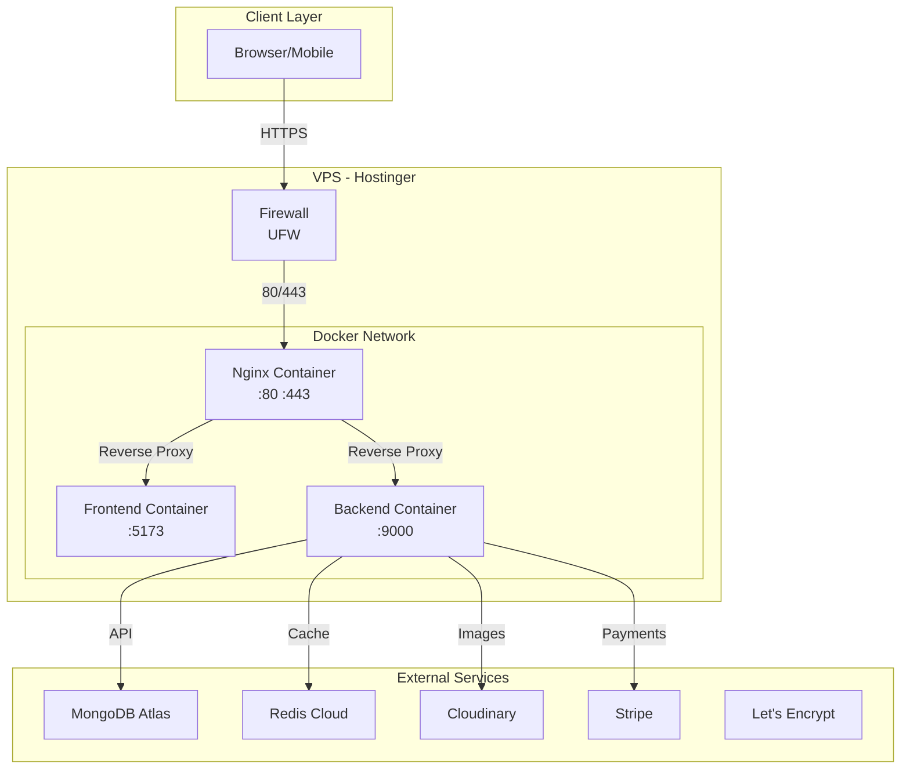

# Markrin E-Commerce Deployment Plan

## Hostinger VPS with Ubuntu - Production Deployment Guide

---

## Table of Contents

1. [Project Overview](#1-project-overview)
2. [Directory Structure Analysis](#2-directory-structure-analysis)
3. [Docker Configuration](#3-docker-configuration)
4. [docker-compose.yml](#4-docker-composeyml)
5. [Nginx Reverse Proxy](#5-nginx-reverse-proxy)
6. [Server Preparation](#6-server-preparation)
7. [Docker Installation](#7-docker-installation)
8. [Deployment Commands](#8-deployment-commands)
9. [Domain & DNS Configuration](#9-domain--dns-configuration)
10. [SSL Certificate Setup](#10-ssl-certificate-setup)
11. [Monitoring & Logging](#11-monitoring--logging)
12. [Backup & Disaster Recovery](#12-backup--disaster-recovery)
13. [Troubleshooting & Maintenance](#13-troubleshooting--maintenance)

---

## 1. Project Overview

### Technology Stack

| Component | Technology | Version |
|-----------|------------|---------|
| Backend | Node.js + Express | v20.x LTS |
| Frontend | React + Vite | React 19.x, Vite 7.x |
| Database | MongoDB Atlas | Cloud-hosted |
| Cache | Redis | v7.x |
| Storage | Cloudinary | Cloud-hosted |
| Payment | Stripe | API v2024.x |
| Web Server | Nginx | v1.24+ |
| Container | Docker | v24+ |
| Container Orchestration | Docker Compose | v2.20+ |
| OS | Ubuntu | 22.04 LTS |

### Architecture Diagram



---

## 2. Directory Structure Analysis

### Root Directory Structure

```
markrin/
├── backend/                    # Express.js API server
│   ├── config/                # Configuration files
│   │   ├── db.js             # MongoDB connection
│   │   ├── redis.js          # Redis connection
│   │   └── cloudinary.js     # Cloudinary config
│   ├── controllers/          # Route controllers
│   │   ├── authController.js
│   │   ├── productController.js
│   │   ├── cartController.js
│   │   ├── orderController.js
│   │   ├── paymentController.js
│   │   ├── adminController.js
│   │   └── ...
│   ├── middleware/           # Express middleware
│   │   ├── authMiddleware.js
│   │   ├── cache.js
│   │   ├── upload.js
│   │   └── validate.js
│   ├── models/               # Mongoose models
│   │   ├── User.js
│   │   ├── Product.js
│   │   ├── Order.js
│   │   ├── Cart.js
│   │   └── ...
│   ├── routes/               # Express routes
│   │   ├── authRoutes.js
│   │   ├── productRoutes.js
│   │   └── ...
│   ├── utils/                # Utility functions
│   │   ├── asyncHandler.js
│   │   ├── generateToken.js
│   │   └── logger.js
│   ├── validations/          # Request validation schemas
│   ├── workers/              # Background workers
│   ├── queues/               # Queue configurations
│   ├── logs/                 # Application logs
│   ├── server.js             # Entry point
│   ├── package.json          # Backend dependencies
│   └── .env                 # Environment variables
│
├── frontend/
│   └── markrin/             # Vite React application
│       ├── src/
│       │   ├── api/         # API client
│       │   ├── components/  # React components
│       │   │   ├── Admin/
│       │   │   ├── Checkout/
│       │   │   ├── Common/
│       │   │   ├── Layout/
│       │   │   └── Products/
│       │   ├── context/     # React contexts
│       │   ├── pages/       # Page components
│       │   ├── utils/       # Utility functions
│       │   ├── App.jsx
│       │   ├── main.jsx
│       │   └── index.css
│       ├── public/          # Static assets
│       ├── package.json     # Frontend dependencies
│       ├── vite.config.js
│       ├── tailwind.config.js
│       └── index.html
│
├── package.json             # Root package.json (concurrently)
├── docker-compose.yml       # Docker Compose configuration
├── nginx/                   # Nginx configurations
│   ├── default.conf
│   └── ssl.conf
└── .env.production         # Production environment variables
```

### Identified Services & Dependencies

| Service | Internal Port | External Port | Purpose |
|---------|---------------|---------------|---------|
| Frontend (Vite) | 5173 | 80→5173 | React SPA |
| Backend (Express) | 9000 | 80→9000 | REST API |
| Nginx | 80, 443 | 80, 443 | Reverse Proxy |

### External Dependencies (Cloud Services)

| Service | Purpose | Configuration |
|---------|---------|---------------|
| MongoDB Atlas | Primary Database | Connection string in `.env` |
| Redis Cloud | Caching & Sessions | `REDIS_URL` in `.env` |
| Cloudinary | Image Storage | `CLOUDINARY_*` in `.env` |
| Stripe | Payment Processing | `STRIPE_*` in `.env` |

---

## 3. Docker Configuration

### 3.1 Backend Dockerfile

Create file: `backend/Dockerfile`

```dockerfile
# Stage 1: Build dependencies
FROM node:20-alpine AS deps
WORKDIR /app
COPY package.json ./
RUN npm ci --only=production

# Stage 2: Production build
FROM node:20-alpine AS builder
WORKDIR /app
COPY package.json ./
RUN npm ci
COPY . .
RUN npm prune --production

# Stage 3: Production runner
FROM node:20-alpine AS runner
WORKDIR /app

# Security: Create non-root user
RUN addgroup --system --gid 1001 nodejs
RUN adduser --system --uid 1001 nodeapp

# Copy only necessary files from builder
COPY --from=deps --chown=nodeapp:nodejs /app/node_modules ./node_modules
COPY --from=builder --chown=nodeapp:nodejs /app ./

# Set environment
ENV NODE_ENV=production
ENV PORT=9000

# Security: Switch to non-root user
USER nodeapp

# Expose port
EXPOSE 9000

# Health check
HEALTHCHECK --interval=30s --timeout=10s --start-period=5s --retries=3 \
    CMD node -e "require('http').get('http://localhost:9000/', (r) => {process.exit(r.statusCode === 200 ? 0 : 1)})"

# Start application
CMD ["node", "server.js"]
```

### 3.2 Frontend Dockerfile

Create file: `frontend/markrin/Dockerfile`

```dockerfile
# Stage 1: Dependencies
FROM node:20-alpine AS deps
WORKDIR /app
COPY package.json ./
RUN npm ci

# Stage 2: Build
FROM node:20-alpine AS builder
WORKDIR /app
COPY package.json ./
RUN npm ci
COPY . .
# Set API URL for production
ARG VITE_API_URL=https://api.yourdomain.com
ENV VITE_API_URL=$VITE_API_URL
RUN npm run build

# Stage 3: Production with Nginx
FROM nginx:alpine AS runner

# Copy custom nginx config
COPY nginx.conf /etc/nginx/nginx.conf

# Copy built assets
COPY --from=builder /app/dist /usr/share/nginx/html

# Create non-root user
RUN adduser -D -g '' nodeapp && \
    chown -R nodeapp:nodeapp /usr/share/nginx/html && \
    chown -R nodeapp:nodeapp /var/cache/nginx && \
    chown -R nodeapp:nodeapp /var/log/nginx && \
    touch /var/run/nginx.pid && \
    chown -R nodeapp:nodeapp /var/run/nginx.pid

# Expose ports
EXPOSE 80

# Health check
HEALTHCHECK --interval=30s --timeout=10s --start-period=5s --retries=3 \
    CMD wget --no-verbose --tries=1 --spider http://localhost/ || exit 1

# Start Nginx
CMD ["nginx", "-g", "daemon off;"]
```

### 3.3 Frontend Nginx Configuration

Create file: `frontend/markrin/nginx.conf`

```nginx
worker_processes auto;
error_log /var/log/nginx/error.log warn;
pid /var/run/nginx.pid;

events {
    worker_connections 1024;
    use epoll;
    multi_accept on;
}

http {
    include /etc/nginx/mime.types;
    default_type application/octet-stream;

    # Logging format
    log_format main '$remote_addr - $remote_user [$time_local] "$request" '
                    '$status $body_bytes_sent "$http_referer" '
                    '"$http_user_agent" "$http_x_forwarded_for"';

    access_log /var/log/nginx/access.log main;

    # Performance optimizations
    sendfile on;
    tcp_nopush on;
    tcp_nodelay on;
    keepalive_timeout 65;
    types_hash_max_size 2048;
    server_tokens off;

    # Gzip compression
    gzip on;
    gzip_vary on;
    gzip_proxied any;
    gzip_comp_level 6;
    gzip_types text/plain text/css text/xml application/json application/javascript 
               application/rss+xml application/atom+xml image/svg+xml;
    gzip_disable "msie6";

    # Security headers
    add_header X-Frame-Options "SAMEORIGIN" always;
    add_header X-Content-Type-Options "nosniff" always;
    add_header X-XSS-Protection "1; mode=block" always;

    # Rate limiting zone
    limit_req_zone $binary_remote_addr zone=api_limit:10m rate=10r/s;

    server {
        listen 80;
        server_name localhost;
        root /usr/share/nginx/html;
        index index.html;

        # Security
        server_tokens off;

        # Cache static assets
        location ~* \.(js|css|png|jpg|jpeg|gif|ico|svg|webp|woff|woff2|ttf|eot)$ {
            expires 1y;
            add_header Cache-Control "public, immutable";
            add_header X-Content-Type-Options "nosniff";
        }

        # Cache HTML (no cache for SPA)
        location ~* \.html$ {
            expires -1;
            add_header Cache-Control "no-store, no-cache, must-revalidate";
        }

        # SPA routing - serve index.html for all routes
        location / {
            try_files $uri $uri/ /index.html;
            
            # Security headers for SPA
            add_header X-Frame-Options "SAMEORIGIN" always;
            add_header X-Content-Type-Options "nosniff" always;
            add_header X-XSS-Protection "1; mode=block" always;
        }

        # Health check endpoint
        location /health {
            access_log off;
            return 200 "healthy\n";
            add_header Content-Type text/plain;
        }
    }
}
```

### 3.4 Production Environment File

Create file: `.env.production`

```bash
# ============================================
# PRODUCTION ENVIRONMENT VARIABLES
# ============================================

# Backend
NODE_ENV=production
PORT=9000

# MongoDB (Use your Atlas connection string)
MONGO_URI=mongodb+srv://<username>:<password>@cluster0.okozycv.mongodb.net/markrin-store?retryWrites=true&w=majority

# Redis (Use your Redis Cloud connection string)
REDIS_URL=redis://<username>:<password>@<host>.up.railway.app:PORT

# JWT (Generate a secure random string)
JWT_SECRET=your-super-secure-jwt-secret-min-32-chars-long

# Cloudinary
CLOUDINARY_CLOUD_NAME=your_cloud_name
CLOUDINARY_API_KEY=your_api_key
CLOUDINARY_API_SECRET=your_api_secret

# Stripe
STRIPE_SECRET_KEY=sk_live_xxxxxxxxxxxxxxxxxxxxx
STRIPE_WEBHOOK_SECRET=whsec_xxxxxxxxxxxxxxxxxxxxx

# Frontend API URL
VITE_API_URL=https://api.yourdomain.com

# CORS (Your domain)
CORS_ORIGIN=https://yourdomain.com
```

---

## 4. docker-compose.yml

Create file: `docker-compose.yml` in project root

```yaml
version: '3.9'

services:
  # ============================================
  # Nginx Reverse Proxy
  # ============================================
  nginx:
    image: nginx:alpine
    container_name: markrin_nginx
    restart: unless-stopped
    ports:
      - "80:80"
      - "443:443"
    volumes:
      - ./nginx:/etc/nginx/conf.d:ro
      - ./nginx/ssl:/etc/nginx/ssl:ro
      - nginx_logs:/var/log/nginx
    depends_on:
      - backend
      - frontend
    networks:
      - markrin_network
    healthcheck:
      test: ["CMD", "wget", "--no-verbose", "--tries=1", "--spider", "http://localhost/health"]
      interval: 30s
      timeout: 10s
      retries: 3
      start_period: 10s
    environment:
      - TZ=Asia/Kolkata
    logging:
      driver: "json-file"
      options:
        max-size: "10m"
        max-file: "3"

  # ============================================
  # Backend API Server
  # ============================================
  backend:
    build:
      context: ./backend
      dockerfile: Dockerfile
    container_name: markrin_backend
    restart: unless-stopped
    expose:
      - "9000"
    env_file:
      - .env.production
    environment:
      - NODE_ENV=production
      - PORT=9000
    volumes:
      - ./backend:/app
      - backend_logs:/app/logs
    networks:
      - markrin_network
    healthcheck:
      test: ["CMD", "wget", "--no-verbose", "--tries=1", "--spider", "http://localhost:9000/"]
      interval: 30s
      timeout: 10s
      retries: 3
      start_period: 40s
    logging:
      driver: "json-file"
      options:
        max-size: "10m"
        max-file: "5"
    deploy:
      resources:
        limits:
          cpus: '1'
          memory: 1G
        reservations:
          cpus: '0.5'
          memory: 512M

  # ============================================
  # Frontend Application
  # ============================================
  frontend:
    build:
      context: ./frontend/markrin
      dockerfile: Dockerfile
      args:
        VITE_API_URL: ${VITE_API_URL:-https://api.yourdomain.com}
    container_name: markrin_frontend
    restart: unless-stopped
    expose:
      - "5173"
    environment:
      - NODE_ENV=production
    volumes:
      - frontend_assets:/usr/share/nginx/html
    networks:
      - markrin_network
    healthcheck:
      test: ["CMD", "wget", "--no-verbose", "--tries=1", "--spider", "http://localhost/"]
      interval: 30s
      timeout: 10s
      retries: 3
      start_period: 20s
    logging:
      driver: "json-file"
      options:
        max-size: "10m"
        max-file: "3"

# ============================================
# Networks
# ============================================
networks:
  markrin_network:
    driver: bridge
    ipam:
      config:
        - subnet: 172.28.0.0/16

# ============================================
# Volumes (Persistent Data)
# ============================================
volumes:
  nginx_logs:
    driver: local
  backend_logs:
    driver: local
  frontend_assets:
    driver: local
```

---

## 5. Nginx Reverse Proxy

### 5.1 Main Nginx Configuration

Create file: `nginx/default.conf`

```nginx
# Upstream definitions
upstream backend {
    server backend:9000 max_fails=3 fail_timeout=30s;
    keepalive 32;
}

upstream frontend {
    server frontend:5173 max_fails=3 fail_timeout=30s;
    keepalive 16;
}

# Rate limiting
limit_req_zone $binary_remote_addr zone=api_limit:10m rate=15r/s;
limit_req_zone $binary_remote_addr zone=auth_limit:10m rate=5r/s;
limit_req_zone $binary_remote_addr zone=general_limit:10m rate=30r/s;

# Main server - HTTP (redirect to HTTPS)
server {
    listen 80;
    server_name yourdomain.com www.yourdomain.com api.yourdomain.com;

    # Let's Encrypt ACME challenge
    location /.well-known/acme-challenge/ {
        root /var/www/html;
        try_files $uri =404;
    }

    # Redirect all HTTP to HTTPS
    location / {
        return 301 https://$host$request_uri;
    }
}

# HTTPS Main Site
server {
    listen 443 ssl http2;
    server_name yourdomain.com www.yourdomain.com;

    # SSL Configuration
    ssl_certificate /etc/nginx/ssl/fullchain.pem;
    ssl_certificate_key /etc/nginx/ssl/privkey.pem;
    ssl_session_timeout 1d;
    ssl_session_cache shared:SSL:50m;
    ssl_session_tickets off;

    # Modern SSL configuration
    ssl_protocols TLSv1.2 TLSv1.3;
    ssl_ciphers ECDHE-ECDSA-AES128-GCM-SHA256:ECDHE-RSA-AES128-GCM-SHA256:ECDHE-ECDSA-AES256-GCM-SHA384:ECDHE-RSA-AES256-GCM-SHA384;
    ssl_prefer_server_ciphers off;

    # OCSP Stapling
    ssl_stapling on;
    ssl_stapling_verify on;
    resolver 8.8.8.8 8.8.4.4 valid=300s;
    resolver_timeout 5s;

    # Security Headers
    add_header Strict-Transport-Security "max-age=63072000; includeSubDomains; preload" always;
    add_header X-Frame-Options "SAMEORIGIN" always;
    add_header X-Content-Type-Options "nosniff" always;
    add_header X-XSS-Protection "1; mode=block" always;
    add_header Referrer-Policy "strict-origin-when-cross-origin" always;
    add_header Permissions-Policy "camera=(), microphone=(), geolocation=()" always;

    # Logging
    access_log /var/log/nginx/access.log main;
    error_log /var/log/nginx/error.log warn;

    # Gzip
    gzip on;
    gzip_vary on;
    gzip_proxied any;
    gzip_comp_level 6;
    gzip_types text/plain text/css text/xml application/json application/javascript 
               application/rss+xml application/atom+xml image/svg+xml;
    gzip_min_length 1000;

    # Static assets caching
    location ~* \.(js|css|png|jpg|jpeg|gif|ico|svg|webp|woff|woff2|ttf|eot|otf)$ {
        proxy_pass http://frontend;
        proxy_cache_valid 200 1y;
        add_header Cache-Control "public, immutable";
        expires 1y;
        add_header X-Content-Type-Options "nosniff";
    }

    # Frontend SPA - all non-API routes
    location / {
        limit_req zone=general_limit burst=50 nodelay;
        proxy_pass http://frontend;
        proxy_http_version 1.1;
        proxy_set_header Upgrade $http_upgrade;
        proxy_set_header Connection 'upgrade';
        proxy_set_header Host $host;
        proxy_set_header X-Real-IP $remote_addr;
        proxy_set_header X-Forwarded-For $proxy_add_x_forwarded_for;
        proxy_set_header X-Forwarded-Proto $scheme;
        proxy_cache_bypass $http_upgrade;
        
        # Timeouts
        proxy_connect_timeout 60s;
        proxy_send_timeout 60s;
        proxy_read_timeout 60s;
    }
}

# HTTPS API Subdomain
server {
    listen 443 ssl http2;
    server_name api.yourdomain.com;

    # SSL Configuration (same as main)
    ssl_certificate /etc/nginx/ssl/fullchain.pem;
    ssl_certificate_key /etc/nginx/ssl/privkey.pem;
    ssl_session_timeout 1d;
    ssl_session_cache shared:SSL:50m;
    ssl_session_tickets off;
    ssl_protocols TLSv1.2 TLSv1.3;
    ssl_ciphers ECDHE-ECDSA-AES128-GCM-SHA256:ECDHE-RSA-AES128-GCM-SHA256:ECDHE-ECDSA-AES256-GCM-SHA384:ECDHE-RSA-AES256-GCM-SHA384;
    ssl_prefer_server_ciphers off;
    ssl_stapling on;
    ssl_stapling_verify on;
    resolver 8.8.8.8 8.8.4.4 valid=300s;

    # Security Headers
    add_header Strict-Transport-Security "max-age=63072000; includeSubDomains; preload" always;
    add_header X-Content-Type-Options "nosniff" always;
    add_header X-XSS-Protection "1; mode=block" always;
    add_header Referrer-Policy "strict-origin-when-cross-origin" always;

    # Logging
    access_log /var/log/nginx/api_access.log main;
    error_log /var/log/nginx/api_error.log warn;

    # Rate limiting by endpoint type
    location /api/auth {
        limit_req zone=auth_limit burst=10 nodelay;
        proxy_pass http://backend;
        proxy_http_version 1.1;
        proxy_set_header Host $host;
        proxy_set_header X-Real-IP $remote_addr;
        proxy_set_header X-Forwarded-For $proxy_add_x_forwarded_for;
        proxy_set_header X-Forwarded-Proto $scheme;
    }

    location /api {
        limit_req zone=api_limit burst=30 nodelay;
        proxy_pass http://backend;
        proxy_http_version 1.1;
        proxy_set_header Host $host;
        proxy_set_header X-Real-IP $remote_addr;
        proxy_set_header X-Forwarded-For $proxy_add_x_forwarded_for;
        proxy_set_header X-Forwarded-Proto $scheme;
        
        # Timeouts for API
        proxy_connect_timeout 30s;
        proxy_send_timeout 30s;
        proxy_read_timeout 30s;
    }

    # Health check endpoint
    location /health {
        proxy_pass http://backend;
        proxy_http_version 1.1;
        proxy_set_header Host $host;
        access_log off;
    }
}
```

---

## 6. Server Preparation

### 6.1 Initial Server Setup

```bash
# ============================================
# STEP 1: Connect to your VPS
# ============================================
ssh root@your_vps_ip

# ============================================
# STEP 2: Update System
# ============================================
apt update && apt upgrade -y

# ============================================
# STEP 3: Create Deployment User
# ============================================
# Create a non-root user for security
adduser deployer
usermod -aG sudo deployer
usermod -aG docker deployer

# Switch to deployer user
su - deployer

# ============================================
# STEP 4: Configure Timezone
# ============================================
sudo timedatectl set-timezone Asia/Kolkata

# ============================================
# STEP 5: Install Basic Tools
# ============================================
sudo apt install -y curl wget git unzip software-properties-common \
    apt-transport-https ca-certificates gnupg lsb-release build-essential \
    htop net-tools ufw fail2ban
```

### 6.2 Firewall Configuration (UFW)

```bash
# ============================================
# STEP 6: Configure UFW Firewall
# ============================================

# Allow SSH (limit rate to prevent brute force)
sudo ufw allow 22/tcp comment 'SSH'
sudo ufw limit 22/tcp

# Allow HTTP and HTTPS
sudo ufw allow 80/tcp comment 'HTTP'
sudo ufw allow 443/tcp comment 'HTTPS'

# Allow custom port for management (optional)
sudo ufw allow 3000/tcp comment 'Traefik Dashboard'

# Enable firewall
sudo ufw --force enable

# Check status
sudo ufw status verbose
```

### 6.3 SSH Security Hardening

```bash
# ============================================
# STEP 7: SSH Security
# ============================================

# Edit SSH config
sudo nano /etc/ssh/sshd_config

# Make these changes:
# Port 22022                    # Change default port
# PermitRootLogin no           # Disable root login
# PasswordAuthentication no    # Disable password auth
# PubkeyAuthentication yes     # Enable key auth
# MaxAuthTries 3               # Limit auth attempts
# ClientAliveInterval 300     # Timeout
# ClientAliveCountMax 2

# Restart SSH
sudo systemctl restart sshd

# Generate SSH key locally (on your machine)
ssh-keygen -t ed25519 -C "your_email@example.com"

# Copy public key to server
ssh-copy-id -p 22022 deployer@your_vps_ip
```

---

## 7. Docker Installation

### 7.1 Install Docker

```bash
# ============================================
# Install Docker on Ubuntu 22.04
# ============================================

# Remove old versions
sudo apt remove -y docker docker-engine docker.io containerd runc

# Install prerequisites
sudo apt install -y apt-transport-https ca-certificates curl gnupg lsb-release

# Add Docker GPG key
curl -fsSL https://download.docker.com/linux/ubuntu/gpg | sudo gpg --dearmor -o /usr/share/keyrings/docker-archive-keyring.gpg

# Add Docker repository
echo "deb [arch=amd64 signed-by=/usr/share/keyrings/docker-archive-keyring.gpg] https://download.docker.com/linux/ubuntu $(lsb_release -cs) stable" | sudo tee /etc/apt/sources.list.d/docker.list > /dev/null

# Install Docker
sudo apt update
sudo apt install -y docker-ce docker-ce-cli containerd.io docker-compose-plugin

# Verify installation
sudo docker --version
sudo docker-compose --version

# ============================================
# Configure Docker
# ============================================

# Start and enable Docker
sudo systemctl start docker
sudo systemctl enable docker

# Add user to docker group
sudo usermod -aG docker $USER

# Configure Docker daemon for production
sudo mkdir -p /etc/docker
sudo tee /etc/docker/daemon.json <<EOF
{
  "log-driver": "json-file",
  "log-opts": {
    "max-size": "10m",
    "max-file": "3"
  },
  "storage-driver": "overlay2",
  "live-restore": true,
  "default-address-pools": [
    {
      "base": "172.17.0.0/12",
      "size": 24
    }
  ]
}
EOF

# Restart Docker
sudo systemctl restart docker

# Enable Docker memory and swap accounting
sudo tee /etc/default/grub <<EOF
GRUB_CMDLINE_LINUX="cgroup_enable=memory swapaccount=1"
EOF
sudo update-grub
```

### 7.2 Install Docker Compose (Standalone)

```bash
# Install Docker Compose v2
sudo curl -L "https://github.com/docker/compose/releases/download/v2.24.0/docker-compose-$(uname -s)-$(uname -m)" -o /usr/local/bin/docker-compose
sudo chmod +x /usr/local/bin/docker-compose
sudo ln -s /usr/local/bin/docker-compose /usr/bin/docker-compose

# Verify
docker-compose --version
```

---

## 8. Deployment Commands

### 8.1 Project Deployment

```bash
# ============================================
# DEPLOY MARKRIN E-COMMERCE
# ============================================

# 1. Create project directory
cd /home/deployer
mkdir -p markrin
cd markrin

# 2. Upload project files (from your local machine)
# Option A: Using git (recommended)
git clone https://github.com/your-repo/markrin.git .
# Or pull latest changes
git pull origin main

# Option B: Using scp
# scp -r ./markrin deployer@your_vps_ip:/home/deployer/

# 3. Create production environment file
cp .env.example .env.production
nano .env.production

# 4. Build and start containers
docker-compose build --no-cache
docker-compose up -d

# 5. Check container status
docker-compose ps
docker ps

# 6. View logs
docker-compose logs -f
docker-compose logs -f backend
docker-compose logs -f nginx

# 7. Verify services
curl -I http://localhost/
curl -I http://localhost/api/
```

### 8.2 Container Management

```bash
# ============================================
# CONTAINER MANAGEMENT COMMANDS
# ============================================

# Start all services
docker-compose start

# Stop all services
docker-compose stop

# Restart all services
docker-compose restart

# Rebuild and start (after code changes)
docker-compose up -d --build

# View all containers
docker ps -a

# View container logs
docker-compose logs -f [service_name]

# Execute command in container
docker exec -it markrin_backend sh
docker exec -it markrin_frontend sh
docker exec -it markrin_nginx sh

# View resource usage
docker stats

# Remove all containers (preserves volumes)
docker-compose down

# Remove everything including volumes
docker-compose down -v

# Remove unused images
docker image prune -a

# Remove unused volumes
docker volume prune
```

### 8.3 Update Deployment

```bash
# ============================================
# UPDATE DEPLOYMENT
# ============================================

# Option 1: Pull latest and rebuild
git pull origin main
docker-compose up -d --build

# Option 2: Restart specific service
docker-compose restart backend
docker-compose restart frontend

# Option 3: Rolling update (zero-downtime)
docker-compose up -d --build --no-deps backend
docker-compose up -d --no-deps frontend
```

### 8.4 Scaling

```bash
# ============================================
# SCALING COMMANDS
# ============================================

# Scale backend to 3 instances
docker-compose up -d --scale backend=3

# Scale with nginx load balancing
# Update nginx.conf to include all backend instances

# Note: For production scaling, consider:
# - Docker Swarm
# - Kubernetes
# - Load balancer (HAProxy, Traefik)
```

---

## 9. Domain & DNS Configuration

### 9.1 DNS Records

| Record Type | Name | Value | TTL |
|-------------|------|-------|-----|
| A | @ | your_vps_ip | 300 |
| A | www | your_vps_ip | 300 |
| A | api | your_vps_ip | 300 |
| CNAME | * | yourdomain.com | 300 |

### 9.2 Configure DNS (Hostinger)

1. Log in to Hostinger hPanel
2. Navigate to **DNS Zone Editor**
3. Add A records:
   - `@` → Your VPS IP
   - `www` → Your VPS IP
   - `api` → Your VPS IP
4. Add CNAME:
   - `*` → @ (wildcard)

### 9.3 Verify DNS

```bash
# Check DNS propagation
dig yourdomain.com
dig api.yourdomain.com
nslookup yourdomain.com

# Check from different locations
curl -I https://yourdomain.com
```

---

## 10. SSL Certificate Setup

### 10.1 Let's Encrypt with Certbot

```bash
# ============================================
# INSTALL CERTBOT
# ============================================

# Install snapd (if not installed)
sudo apt install -y snapd

# Install certbot via snap
sudo snap install --classic certbot

# Create symbolic link
sudo ln -s /snap/bin/certbot /usr/bin/certbot

# ============================================
# OBTAIN SSL CERTIFICATE
# ============================================

# Stop nginx temporarily
docker-compose stop nginx

# Obtain certificate
sudo certbot certonly --standalone -d yourdomain.com -d www.yourdomain.com -d api.yourdomain.com

# Or use webroot (if nginx is running)
sudo certbot certonly --webroot -w /var/www/html -d yourdomain.com -d www.yourdomain.com -d api.yourdomain.com

# ============================================
# COPY CERTIFICATES
# ============================================

# Create SSL directory
mkdir -p nginx/ssl

# Copy certificates
sudo cp /etc/letsencrypt/live/yourdomain.com/fullchain.pem nginx/ssl/
sudo cp /etc/letsencrypt/live/yourdomain.com/privkey.pem nginx/ssl/

# Set proper permissions
chmod 644 nginx/ssl/fullchain.pem
chmod 600 nginx/ssl/privkey.pem

# Start nginx
docker-compose start nginx

# ============================================
# AUTO-RENEWAL SETUP
# ============================================

# Test automatic renewal
sudo certbot renew --dry-run

# Create renewal script
sudo tee /etc/cron.d/certbot-renew <<EOF
0 3 * * * root docker-compose -f /home/deployer/markrin/docker-compose.yml stop nginx && \
    certbot renew --quiet --deploy-hook "cp /etc/letsencrypt/live/yourdomain.com/fullchain.pem /home/deployer/markrin/nginx/ssl/ && \
    cp /etc/letsencrypt/live/yourdomain.com/privkey.pem /home/deployer/markrin/nginx/ssl/" && \
    docker-compose -f /home/deployer/markrin/docker-compose.yml start nginx
EOF

# Reload cron
sudo systemctl reload cron
```

### 10.2 Alternative: Using Cloudflare

If using Cloudflare for DNS:

1. Sign up for Cloudflare and add your domain
2. Update nameservers at Hostinger
3. In Cloudflare, create A records pointing to your VPS
4. Enable "Full (strict)" SSL mode in Cloudflare
5. Use Cloudflare's automatically generated SSL

---

## 11. Monitoring & Logging

### 11.1 Container Logging

```bash
# ============================================
# LOGGING CONFIGURATION
# ============================================

# View all container logs
docker-compose logs -f

# View specific service logs
docker-compose logs -f backend
docker-compose logs -f frontend
docker-compose logs -f nginx

# Export logs to file
docker-compose logs > markrin_logs.txt

# Filter logs by time
docker-compose logs --since 1h
docker-compose logs --tail=100

# View with timestamps
docker-compose logs -t
```

### 11.2 Log Rotation

Create file: `/etc/logrotate.d/docker-compose`

```
/home/deployer/markrin/*.log {
    daily
    rotate 14
    compress
    delaycompress
    notifempty
    create 0644 deployer deployer
    postrotate
        docker-compose -f /home/deployer/markrin/docker-compose.yml restart > /dev/null 2>&1 || true
    endscript
}
```

### 11.3 Health Monitoring Script

Create file: `monitor.sh`

```bash
#!/bin/bash
# Health monitoring script

# Telegram notification function
send_telegram() {
    curl -s -X POST "https://api.telegram.org/bot$BOT_TOKEN/sendMessage" \
        -d "chat_id=$CHAT_ID" \
        -d "text=$1"
}

# Check container health
check_health() {
    # Check backend
    BACKEND_STATUS=$(docker inspect --format='{{.State.Health.Status}}' markrin_backend 2>/dev/null || echo "unknown")
    
    # Check frontend
    FRONTEND_STATUS=$(docker inspect --format='{{.State.Health.Status}}' markrin_frontend 2>/dev/null || echo "unknown")
    
    # Check nginx
    NGINX_STATUS=$(docker inspect --format='{{.State.Health.Status}}' markrin_nginx 2>/dev/null || echo "unknown")
    
    # Check disk space
    DISK_USAGE=$(df -h / | awk 'NR==2 {print $5}' | sed 's/%//')
    
    # Check memory
    MEMORY_USAGE=$(free | awk '/Mem:/ {printf "%.0f", $3/$2 * 100}')
    
    # Check if any container is down
    if [ "$BACKEND_STATUS" != "healthy" ] || [ "$FRONTEND_STATUS" != "healthy" ] || [ "$NGINX_STATUS" != "healthy" ]; then
        send_telegram "🚨 ALERT: Container issue detected!\nBackend: $BACKEND_STATUS\nFrontend: $FRONTEND_STATUS\nNginx: $NGINX_STATUS"
    fi
    
    # Alert on high resource usage
    if [ "$DISK_USAGE" -gt 85 ]; then
        send_telegram "⚠️ WARNING: Disk usage at ${DISK_USAGE}%"
    fi
    
    if [ "$MEMORY_USAGE" -gt 90 ]; then
        send_telegram "⚠️ WARNING: Memory usage at ${MEMORY_USAGE}%"
    fi
}

# Run health check every 5 minutes
while true; do
    check_health
    sleep 300
done
```

### 11.4 System Monitoring with Netdata (Optional)

```bash
# Install Netdata for real-time monitoring
bash <(curl -Ss https://my-netdata.io/kickstart.sh) --dont-wait

# Access at: http://your_vps_ip:19999
```

---

## 12. Backup & Disaster Recovery

### 12.1 Automated Backup Script

Create file: `backup.sh`

```bash
#!/bin/bash
# ============================================
# BACKUP SCRIPT FOR MARKRIN
# ============================================

# Configuration
BACKUP_DIR="/home/deployer/backups"
DATE=$(date +%Y%m%d_%H%M%S)
RETENTION_DAYS=30

# Create backup directory
mkdir -p $BACKUP_DIR

# ============================================
# Backup Application Files
# ============================================
echo "Backing up application files..."
tar -czf $BACKUP_DIR/app_$DATE.tar.gz \
    --exclude='node_modules' \
    --exclude='.git' \
    --exclude='dist' \
    /home/deployer/markrin/

# ============================================
# Backup Environment Files
# ============================================
echo "Backing up environment files..."
cp /home/deployer/markrin/.env.production $BACKUP_DIR/env_$DATE.backup

# ============================================
# Backup Docker Volumes
# ============================================
echo "Backing up Docker volumes..."
docker run --rm \
    -v markrin_nginx_logs:/data \
    -v $BACKUP_DIR:/backup \
    alpine tar -czf /backup/nginx_logs_$DATE.tar.gz -C /data .

# ============================================
# Upload to Remote Storage (S3/Backblaze)
# ============================================
# Option: Upload to Backblaze B2
b2 authorize_account [keyID] [applicationKey]
b2 upload_file markrin-backups app_$DATE.tar.gz
b2 upload_file markrin-backups env_$DATE.backup

# ============================================
# Cleanup Old Backups
# ============================================
echo "Cleaning up old backups..."
find $BACKUP_DIR -type f -mtime +$RETENTION_DAYS -delete

echo "Backup completed: $DATE"
```

### 12.2 Cron Job for Backups

```bash
# Add to crontab
crontab -e

# Add this line (daily at 3 AM)
0 3 * * * /home/deployer/backup.sh >> /home/deployer/logs/backup.log 2>&1
```

### 12.3 Disaster Recovery Procedures

```bash
# ============================================
# DISASTER RECOVERY PROCEDURES
# ============================================

# Scenario 1: Complete Server Failure
# -------------------------------------
# 1. Provision new VPS
# 2. Follow Server Preparation steps (Section 6)
# 3. Install Docker (Section 7)
# 4. Clone repository
# 5. Restore .env.production from backup
# 6. Restore SSL certificates
# 7. Run docker-compose up -d

# Scenario 2: Container Failure
# -------------------------------------
# 1. Check logs: docker-compose logs -f
# 2. Restart containers: docker-compose restart
# 3. If persistent, rebuild: docker-compose up -d --build
# 4. If still failing, restore from backup

# Scenario 3: Database Recovery (MongoDB Atlas)
# -------------------------------------
# 1. Log in to MongoDB Atlas
# 2. Go to Backups
# 3. Restore to new cluster
# 4. Update MONGO_URI in .env.production
# 5. Restart backend: docker-compose restart backend

# Scenario 4: Rollback to Previous Version
# -------------------------------------
# 1. Check git log for previous versions
git log --oneline
# 2. Checkout previous version
git checkout <commit-hash>
# 3. Rebuild and deploy
docker-compose up -d --build
```

---

## 13. Troubleshooting & Maintenance

### 13.1 Common Issues & Solutions

```bash
# ============================================
# TROUBLESHOOTING COMMON ISSUES
# ============================================

# Issue: Containers not starting
# Solution: Check logs and ports
docker-compose logs
netstat -tlnp | grep -E ':(80|443|5173|9000)'

# Issue: Backend cannot connect to MongoDB
# Solution: Check IP whitelist in MongoDB Atlas
# 1. Go to MongoDB Atlas > Network Access
# 2. Add your VPS IP to whitelist

# Issue: Redis connection failed
# Solution: Check REDIS_URL in .env.production
# Verify Redis Cloud allows your IP

# Issue: SSL certificate not working
# Solution: Check certificate files
ls -la nginx/ssl/
# Renew if expired
sudo certbot renew

# Issue: High memory usage
# Solution: Check Docker stats and optimize
docker stats
# Restart containers if needed
docker-compose restart

# Issue: Frontend not loading
# Solution: Check nginx logs
docker-compose logs nginx
# Rebuild frontend
docker-compose up -d --build frontend
```

### 13.2 Performance Optimization

```bash
# ============================================
# PERFORMANCE OPTIMIZATION
# ============================================

# 1. Enable Redis caching (already in backend code)
# Ensure REDIS_URL is configured in .env.production

# 2. Optimize Nginx caching
# Already configured in nginx/default.conf

# 3. Enable gzip compression
# Already enabled in nginx config

# 4. Monitor with docker stats
docker stats

# 5. Prune unused Docker resources weekly
docker system prune -a --volumes
```

### 13.3 Security Checklist

```bash
# ============================================
# SECURITY HARDENING CHECKLIST
# ============================================

# 1. Firewall enabled
sudo ufw status

# 2. SSH key-based auth only
# Edit /etc/ssh/sshd_config and set PasswordAuthentication no

# 3. Docker running as non-root
# Verified by using USER directive in Dockerfiles

# 4. Environment variables secure
# .env.production should never be committed to git

# 5. SSL/TLS enabled
# Verify at: https://www.ssllabs.com/ssltest/

# 6. Regular updates
sudo apt update && sudo apt upgrade -y

# 7. Fail2ban installed and configured
sudo fail2ban-client status
```

### 13.4 Maintenance Commands

```bash
# ============================================
# REGULAR MAINTENANCE COMMANDS
# ============================================

# Weekly: Clean up unused Docker resources
docker system prune -a --volumes --force

# Weekly: Update Docker images
docker-compose pull
docker-compose up -d

# Monthly: Apply OS security updates
sudo apt update && sudo apt upgrade -y

# Monthly: Check SSL certificate expiration
sudo certbot certificates

# As needed: Clear Docker build cache
docker builder prune -a
```

---

## Quick Reference Card

### Essential Commands

```bash
# Deploy/Update
docker-compose up -d --build

# View logs
docker-compose logs -f

# Check status
docker-compose ps

# Restart services
docker-compose restart

# Stop all
docker-compose stop

# Start all
docker-compose start

# SSH into container
docker exec -it markrin_backend sh
```

### URLs After Deployment

| Service | URL |
|---------|-----|
| Frontend | https://yourdomain.com |
| API | https://api.yourdomain.com/api/ |
| Health Check | https://api.yourdomain.com/health |

---

## Support & Resources

- Docker Docs: https://docs.docker.com/
- Nginx Docs: https://nginx.org/en/docs/
- Let's Encrypt: https://letsencrypt.org/docs/
- MongoDB Atlas: https://www.mongodb.com/cloud/atlas
- Redis Cloud: https://redis.com/redis-cloud/
- Cloudinary: https://cloudinary.com/documentation/

---

*Document Version: 1.0*  
*Last Updated: 2026-02-27*  
*For: Markrin E-Commerce Platform*
